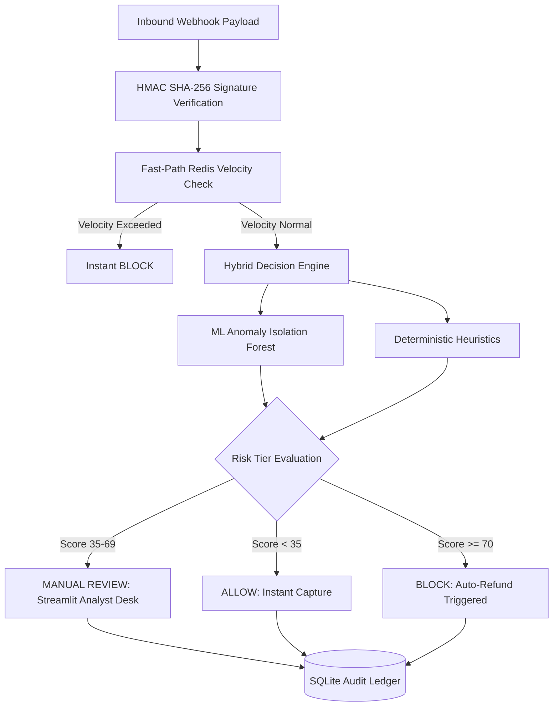

# ShieldFlow AI 🛡️
> Sub-10ms Real-Time Payment Risk Decisioning & Fraud Mitigation Gateway

[](https://github.com/suhanikri/shieldflow-ai/actions)
[](https://www.python.org/)
[](https://fastapi.tiangolo.com/)
[](https://nextjs.org/)
[](https://opensource.org/licenses/MIT)

---

## ⚡ Overview

ShieldFlow AI is a high-throughput, low-latency risk evaluation gateway built for high-volume payment ecosystems like Razorpay and Stripe.

In payment processing, deep neural networks introduce latency bottlenecks that cause checkout drop-offs, while basic rule engines generate high false-positive decline rates. ShieldFlow AI bridges this gap with a hybrid decisioning pipeline:

1. **Cryptographic Validation:** Instant HMAC SHA-256 webhook signature verification.
2. **Fast-Path Caching Layer:** Redis sliding-window velocity counters enforcing rate bounds in `< 2ms`.
3. **Dual-Stage ML & Heuristic Engine:** Unsupervised Isolation Forest Anomaly Detection combined with deterministic filters.
4. **Human-in-the-Loop (HITL) Desk:** Borderline transactions (scores 35–69) are flagged to an analyst operations desk with SQLite audit persistence.

---

## 🏛️ System Architecture



---

## 🚀 Key Features

* **Sub-10ms Roundtrip Inference:** Optimized execution pipeline ensuring minimal checkout overhead.
* **Cryptographic Payload Verification:** Validates webhook signatures against symmetric API secrets.
* **Unsupervised Anomaly Scoring:** Scikit-Learn Isolation Forest detects statistical outliers.
* **Granular Explainability:** Quantified, SHAP-style risk attribution weights returned with every payload.
* **Analyst Ops Console:** Interactive Streamlit dashboard for real-time payload testing and overrides.
* **Real-Time Telemetry Dashboard:** Next.js + Tailwind CSS UI with continuous webhook simulation.
* **CI/CD Reliability:** GitHub Actions pipeline running automated Pytest suites against live Redis test containers.

---

## 🛠️ Tech Stack

* **Backend Engine:** Python 3.11, FastAPI, Uvicorn, Pydantic v2
* **Machine Learning:** Scikit-Learn (Isolation Forest), NumPy
* **Fast-Path Storage & Caching:** Redis (Sliding-window counters)
* **Persistent Storage:** SQLite3 (Audit logs, Analyst states)
* **Analyst Console:** Streamlit
* **Telemetry Dashboard:** Next.js 15, React 19, Tailwind CSS, Lucide Icons
* **Testing & CI:** Pytest, HTTPX, GitHub Actions, Docker Compose

---

## 💻 Local Setup & Installation

### 1. Clone the Repository
```bash
git clone https://github.com/suhanikri/shieldflow-ai.git
cd shieldflow-ai
```

### 2. Configure Backend Virtual Environment
```bash
python -m venv venv
```

**Activate Environment:**
* Windows (PowerShell): `.\venv\Scripts\Activate.ps1`
* Linux / macOS: `source venv/bin/activate`

**Install dependencies:**
```bash
pip install -r requirements.txt
```

### 3. Launch the Backend API
```bash
uvicorn api:app --reload --port 8000
```
Interactive API Documentation (Swagger UI): `http://localhost:8000/docs`

### 4. Launch the Streamlit Analyst Ops Desk
```bash
streamlit run app.py
```
Operations Desk: `http://localhost:8501`

### 5. Launch the Next.js Telemetry Dashboard
```bash
cd frontend
npm install
npm run dev
```
Telemetry Dashboard: `http://localhost:3000`

---

## 🧪 Testing & Simulation

### Run Automated Unit Tests
```bash
pytest -v test_shieldflow.py
```

### Run Live Continuous Traffic Daemon
```bash
python simulate_webhook.py
```

---

## 📄 License
This project is open-source and licensed under the MIT License.
