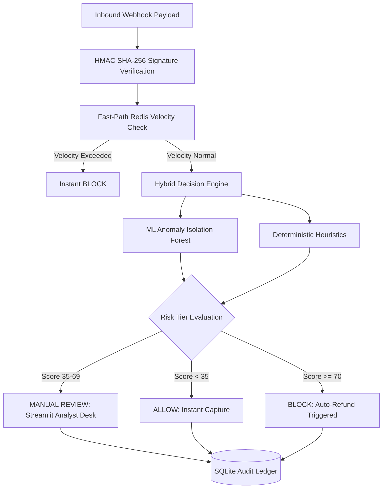

# 🛡️ ShieldFlow AI — Real-Time Payment Risk & Fraud Mitigation Engine

[](https://github.com/suhanikri/shieldflow-ai/actions)
[](https://www.python.org/)
[](https://fastapi.tiangolo.com/)
[](https://www.docker.com/)
[](https://redis.io/)
[](https://prometheus.io/)

---

## ⚡ Overview

**ShieldFlow AI** is a high-throughput, low-latency risk evaluation gateway built for modern fintech payment ecosystems (such as Razorpay and Stripe).

In digital payments, traditional rule engines miss sophisticated fraud patterns, while deep learning architectures introduce latency bottlenecks that increase customer checkout drop-off. ShieldFlow AI bridges this gap with a **hybrid decisioning pipeline**:

1. **Cryptographic Verification:** Sub-millisecond HMAC SHA-256 webhook authentication.
2. **Fast-Path Caching Layer:** Redis sliding-window velocity counters enforcing rate bounds in `< 2ms`.
3. **Dual-Stage ML & Heuristics:** Unsupervised **Isolation Forest Anomaly Detection** combined with deterministic security checks (disposable domains, datacenter proxy ASNs, COD anomalies).
4. **Human-in-the-Loop (HITL) Operations:** Borderline transactions (scores 35–69) are routed to an analyst review desk with persistent SQLite audit trails.

---

## 🏛️ System Architecture



---

## 🚀 Key Features

* **Sub-10ms Inference Latency:** Optimized execution pipeline ensuring minimal checkout overhead.
* **Cryptographic Payload Verification:** Validates incoming webhook signatures against symmetric API secrets.
* **Unsupervised Anomaly Detection:** Scikit-Learn Isolation Forest detects statistical outliers across multi-dimensional feature spaces.
* **Granular Explainability:** Quantified, SHAP-style risk attribution weights returned with every payload evaluation.
* **Analyst Ops Console:** Interactive Streamlit dashboard for manual overrides, payload evaluation, and database queries.
* **Real-Time Telemetry Dashboard:** Next.js + Tailwind CSS interface with live continuous webhook simulations.
* **Automated CI/CD:** GitHub Actions test pipeline verifying Pytest suites against live Redis service containers.

---

## 🛠️ Tech Stack

* **Backend Engine:** Python 3.11, FastAPI, Uvicorn, Pydantic v2
* **Machine Learning:** Scikit-Learn (Isolation Forest), NumPy
* **Fast-Path Storage & Caching:** Redis (Sliding-window counters)
* **Persistent Storage:** SQLite3 (Audit logs, Analyst states)
* **Analyst Console:** Streamlit
* **Telemetry Dashboard:** Next.js 15, React 19, Tailwind CSS, Lucide Icons
* **Testing & CI:** Pytest, HTTPX, GitHub Actions, Docker Compose

---

## 💻 Local Setup & Installation

### 1. Clone the Repository
```bash
git clone https://github.com/suhanikri/shieldflow-ai.git
cd shieldflow-ai
```

### 2. Configure Backend Virtual Environment
```bash
python -m venv venv
```

**Activate Environment:**
* Windows (PowerShell): `.\venv\Scripts\Activate.ps1`
* Linux / macOS: `source venv/bin/activate`

**Install dependencies:**
```bash
pip install -r requirements.txt
```

### 3. Launch the Backend API
```bash
uvicorn api:app --reload --port 8000
```
*Interactive API Documentation (Swagger UI): `http://localhost:8000/docs`*

### 4. Launch the Streamlit Analyst Ops Desk
```bash
streamlit run app.py
```
*Operations Desk: `http://localhost:8501`*

### 5. Launch the Next.js Telemetry Dashboard
```bash
cd frontend
npm install
npm run dev
```
*Telemetry Dashboard: `http://localhost:3000`*

---

## 🧪 Testing & Simulation

### Run Automated Unit Tests
```bash
pytest -v test_shieldflow.py
```

### Run Live Continuous Traffic Daemon
```bash
python simulate_webhook.py
```

---

## 📄 License
This project is open-source and licensed under the [MIT License](LICENSE).
